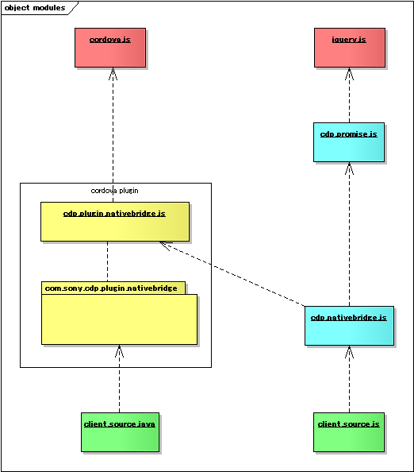
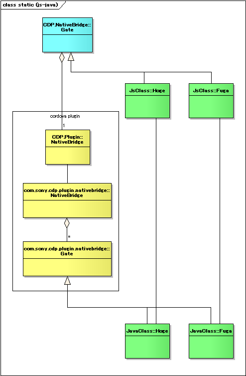
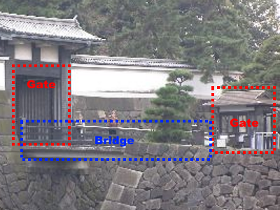
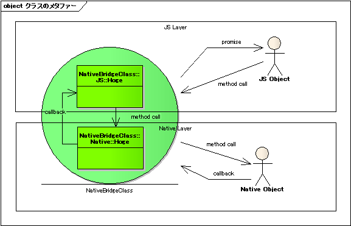

Developlers Guide
======

The page which explains how to use the `cordova-plugin-cdp-nativebridge` and the `cdp.nativebridge.js`.

- [Why is it necessary?](#WHY)
- [Design Information](#DEVINFO)
    - [Module Structure](#MODULE)
    - [Class Structure](#CLASS)
    - [Calling agreement in Native Bridge classes](#CALLING_AGREEMENT)
- [How to Create/Use the Native Bridge class](#HOW_TO)
    - [JS layer](#JS)
        - [The available method list in the JS layer](#JS_METHOD)
    - [Native layer (Android)](#JAVA)
        - [Practice1: Threading](#JAVA_ASYNC)
        - [Practice2: Canceling threading process](#JAVA_ASYNC_CANCELING)
        - [Practice3: Cordova Plugin Compatible method calling](#JAVA_COMPATIBLE)
        - [The available method list in the Native layer](#JAVA_METHOD)
    - [Native layer (iOS)](#OBJC)
        - [Practice1: Threading](#OBJC_ASYNC)
        - [Practice2: Canceling threading process](#OBJC_ASYNC_CANCELING)
        - [Practice3: Cordova Plugin Compatible method calling](#OBJC_COMPATIBLE)
        - [The available method list in the Native layer](#OBJC_METHOD)

# <a name="WHY"/>1:Why is it necessary?

Usually you need to create cordova plugin when you want to use native function with cordova 3.x+ framework.
We think it is useful to create resusable moudle as plugin, but in the following situations, it is too much cost and over spec.

- Case of just calling veriy small or simple native function.
- Case of just connect with native code already implemented for translation. (When reusability is low even if it's made Plugin.)

If you use the `cordova-plugin-cdp-nativebridge` and `cdp.nativebridge.js`, you should do only the following thing.

- 1. Install `cordova-plugin-cdp-nativebridge` as generic native bridge to your project.
- 2. Create JavaScript (TypeScript) class from cdp.nativebridge.js as subclass, and add methods.
- 3. Create Native class which corresponds to JavaScript class and add the methods which corresponds.

That's all. There are no restrictions in the unit of the class. Please add JavaScript files and a Native files freely. You need not to prepare plugin.xml.

We prepared for the easy system such as [JS file : Native file] = [1:1] relation.


# <a name="DEVINFO"/>2: Design Information

Before explaining how to use deeply, We describe fundamental design of `cordova-plugin-cdp-nativebridge` and `cdp.nativebridge.js`.


## <a name="MODULE"/>2-1:Module Structure



| module/package                     |type                              | description                                                             |
|:-----------------------------------|:---------------------------------|:------------------------------------------------------------------------|
| cordova.js                         | 3rd js module                    | cordova framework                                                       |
| jquery.js                          | 3rd js module                    | jQuery. Asynchronous utility  Deferred object is used.                  |
| cdp.promise.js                     | CDP js module                    | CDP utility library. The module provides cancelable Promise object.     |
| `cdp.nativebridge.js`              | CDP js module                    | Wrapper library for cordova-plugin-cdp-nativebridge.                    |
| `cdp.plugin.nativebridge.js`       | CDP cordova plugin module        | General-purpose of the cordova plugin which achieves Native Bridge.     |
| `com.sony.cdp.plugin.nativebridge` | CDP cordova plugin native source | Anroid native sources package of general-purpose of the cordova plugin. |
| client_source.java                 | client source                    | Native implementation of client side.                                   |
| client_source.js(.ts)              | client source                    | JavaScript implementation of client side.                               |

- `cordova-plugin-cdp-nativebridge` as its name suggests is cordova plugin. This module is not depend on the other libraries.
- `cdp.nativebridge.js` is the JS module to which a symmetrical relation of JS-native is offered. This module is depend on the cdp.promise.js and jquery.js.


## <a name="CLASS"/>2-2:Class Structure



| class                                         | description                                                                                                                                                       |
|:----------------------------------------------|:------------------------------------------------------------------------------------------------------------------------------------------------------------------|
| `CDP.NativeBridge.Gate`                       | Base class for the JS extended class. This is relevant to the gate so called bridge's gate (portal). `cdp.nativebridge.js` provides.                              |
| CDP.Plugin.NativeBridge                       | Bridge class on JS layer. Indeed it's a bridge and the client don't have to worry about this class. implemented as cordva-plugin.                                 |
| com.sony.cdp.plugin.nativebridge.NativeBridge | Bridge class on Native layer (Android). Indeed it's a bridge and the client don't have to worry about this class, too. implemented as cordva-plugin all the same. |
| `com.sony.cdp.plugin.nativebridge.Gate`       | Base class for the Native extended class. This is relevant to the gate so called bridge's gate (portal). `cordva-plugin` provides.                                |

The client neet to define the following:

    Create the sub class from `CDP.NativeBridge.Gate` in JS layer.
    Create the sub class from `com.sony.cdp.plugin.nativebridge.Gate` in Native layer.

Then the class defined in JS layer starts to react to the class defined Native layer.





## <a name="CALLING_AGREEMENT"/>2-3:Calling agreement in Native Bridge classes

The following figure is a conceptual diagram of a calling agreement in the class this framework offers.



- It's possible to assume from a JS layer that the traffic to a Native layer is equal to a method call.
- The other way, the traffic to a JS layer from the native layer, it's possible to consider as it is equal to the call back (or Promise if by useing `cdp.nativebridge.js`).

This behavior is because of cordova default communication model.

In the general hybrid application, JS layer is designed to high level layer which is an application model, and Native layer is used in low level function service layer.

If you'd like to communicate by a method call from the Native to JS direction, you can realize to make another hierarchy wrapper layer.
However please remember that the Native Bridge framework doesn't provide the function.


# <a name="HOW_TO"/>3:How to Create/Use the Native Bridge class

## <a name="JS"/>3-1:JS layer

An example of class definition of a JS layer is indicated below. (It's written by TypeScript.)

```javascript
/// <reference path="modules/include/cdp.nativebridge.d.ts" />

module SampleApp {

    import Promise = CDP.NativeBridge.Promise;

    var TAG: string = "[SampleApp.SimpleGate] ";

    /**
     * @class SimpleGate
     * @brief The client definied NativeBridge.Gate class.
     */
    export class SimpleGate extends CDP.NativeBridge.Gate {
        /**
         * constructor
         *
         */
        constructor() {
            super({                                                     // set CDP.NativeBridge.Feature object to super constructor. (required)
                name: "SimpleGate",
                android: {
                    packageInfo: "com.sony.cdp.sample.SimpleGate",      // the class name used by reflection in Anroid Java.
                },
                ios: {
                    packageInfo: "SMPSimpleGate",                       // the class name used by reflection in Objective-C.
                },
            });
        }

        ///////////////////////////////////////////////////////////////////////
        // public methods

        /**
         * coolMethod
         * an example definition of client method.
         *
         * any type of primitive / JSON is available. (cordova compatible. void is also possible.)
         * default return value is Promise object.
         */
        public coolMethod(arg1: number, arg2: boolean, arg3: string, arg4: Object): Promise {
            /*
             * calling super.exec().
             * the first argument is method name set by string.
             * the second argument is "arguments" set available. (<any> cast required)
             *
             * !! Note !!
             * When null/undefined passes to arguments, you must to set default value to the argument in this layer.
             */
            return super.exec("coolMethod", <any>arguments);
        }
    }
}
```

There are careful points of a method requirement as following.

- To call `cordova`, it'll be the asynchronous method certainly.
    - Default return value type is `CDP.NativeBridge.Promise`.
- When `null` or `undefined` passes to arguments, the framework occurs `CDP.NativeBridge.ERROR_INVALID_ARG` error.
    - Please substitute value for the default argument in the method definition if there is possibility set the null or undefined to the arguments.
- The string value of the `<platform>.packageInfo` has to be the name which becomes a project uniquely.
    - For a substantiation (reflection) to do a class from a character string, it's necessary to use by the class name which is project unique. (cordova plugin root Class name has same issue.)
- If you omit `<platform>` property of Feature object, the framework returns `CDP.NativeBridge.ERROR_NOT_SUPPORT` error when the function is called on the omitted platform.
    - If you want, it's possible to treat normal case as the application specification by the handling this error.
    - For example if you will use the function only implemented in `android`, you can omit the `ios` property.


You can use the above-mentioned class as follows.

```javascript
    function main(): void {
        // create instance
        var gate = new SampleApp.SimpleGate();

        // call defined method
        gate.coolMethod(1, false, "test", { ok: true })
            .then((result: CDP.NativeBridge.IResult) => {
                // succeeded case
                console.log(result.code === CDP.NativeBridge.SUCCESS_OK);   // true
                console.log(result.params);                                 // object (return values information)
            })
            .fail((error: CDP.NativeBridge.IResult) => {
                // failed case
                console.error(error.message);
            });
    }
```

### <a name="JS_METHOD"/>3-1-1:The available method list in the JS layer

- The class `CDP.NativeBridge.Gate` provides the methods and properties as follows.

 ※About ExecOption, please refer to a javadoc comment. We don't mention this document.

| method                                                               | description                                                                                                                                                                                                      |
|:---------------------------------------------------------------------|:-----------------------------------------------------------------------------------------------------------------------------------------------------------------------------------------------------------------|
| `exec(method: string, args?: any[], options?: ExecOptions): Promise` | The framework calls Native Class member method responded with method name string.                                                                                                                                |
| `cancel(options?: ExecOptions): JQueryPromise<IResult>`              | The framework cancels all tasks relation with the instance.  The returned info is only success or failure of itself. The result of task is returned on the callback of exec() mehtod.                            |
| `dispose(options?: ExecOptions): JQueryPromise<IResult>`             | The framework releases a reference of Native object. It's assumed to call just before the destruction of the object, then the object becomes invalid when the method called. The return value is same as cancel. |


| property                          | description                                                                                                                                                                                           |
|:----------------------------------|:------------------------------------------------------------------------------------------------------------------------------------------------------------------------------------------------------|
| `bridge: CDP.Plugin.NativeBridge` | This property is accessor for low level NativeBridge object in cordov plugin. This property is protected attribute. You can use `bridge.exec()` as Low-level API that is `cordova.exec()` compatible. |


## <a name="JAVA"/>3-2:Native layer (Android)

An example of JAVA class definition of a Native layer is indicated below.


```java
package com.sony.cdp.sample;

import org.apache.cordova.CallbackContext;
import org.json.JSONArray;
import org.json.JSONException;
import org.json.JSONObject;

import android.util.Log;

import com.sony.cdp.plugin.nativebridge.Gate;
import com.sony.cdp.plugin.nativebridge.MessageUtils;


/**
 * @class SimpleGate
 * @brief Sample gate class
 */
public class SimpleGate extends Gate {
    private static final String TAG = "[com.sony.cdp.sample][Native][SimpleGate] ";

    ///////////////////////////////////////////////////////////////////////
    // public mehtods

    /**
     * Sample method
     * you can receive method with arguments that called from JavaScript layer.
     * numeric value is fixed as double.
     *
     * you can use follow method for returning value.
     *  - returnParams()
     *
     * @throws JSONException
     */
    public void coolMethod(double arg1, boolean arg2, String arg3, JSONObject arg4) throws JSONException {
        // ※the first argument mapped from number to double.

        // any processing...
        String msg = "arg1: " + String.valueOf((int)arg1) + ", arg2: " + String.valueOf(arg2) + ", arg3: " + arg3;
        msg += (", 日本語でOK: " + String.valueOf(arg4.getBoolean("ok")));

        // you can return a valeu with returnParams(). (The method has same semantics as return statement.)
        returnParams(msg);
    }
}

```
※NOTE:
- `number` type of JS layer is mapped to `double` in Java layer.
    - It's designed to the specification of JavaScript.
    - However we give up treating the precision because integer is changed to `int` and small number is changed to `float` once in the cordova framework.

The Gate class has same member property of CordovaPlugin. You can access the following properties.

※But, property attribute is set to `protected`, so accessibility degrade more than the original.
- `cordova`
- `webView`
- `preferences`


### <a name="JAVA_ASYNC"/>3-2-1:Practice1: Threading

If you want to do asynchronous processing, you can acquire `context` and same way of a cordova plug-in as follows.

```java
    /**
     * Sample mehtod (Threading)
     * if argument type defined with "final", the framework can resolve refrection.
     * you can get MethodContext object that is compatible CallbackContext by calling getContext().
     *
     * you can use the follow methods in worker thread.
     *  - notifyParams()
     *  - resolveParams()
     *  - rejectParams()
     *
     */
    public void threadMethod(final double arg1, final boolean arg2, final String arg3, final JSONObject arg4) {
        // get context object from base class's member. if you call without argument, the framework doesn't callback implicitly.
        // [!! NOTE !!] Getting context is permitted only in the method called thread.
        final MethodContext context = getContext();

        // cordova instance is defined as base class property.
        // The example creates worker thread by the way of the cordova formal document.
        cordova.getThreadPool().execute(new Runnable() {
            public void run() {
                String errorMsg;
                try {
                    // notifyParams has same semantics as jQuery.Deferred.notify() method.
                    //  This example uses the method that set "keepCallback = true" implicitly.
                    //  and Result Code is set to SUCCESS_PROGRESS.
                    notifyParams(context, (int)arg1, arg2);
                    notifyParams(context, arg3, arg4);

                    // any processing...
                    String msg = "arg1: " + String.valueOf((int)arg1) + ", arg2: " + String.valueOf(arg2) + ", arg3: " + arg3;
                    msg += (", 日本語でOK: " + String.valueOf(arg4.getBoolean("ok")));

                    // resolveParams has same semantics as jQuery.Deferred.resolve().
                    // the framework set "keepCallback = false" when this method called.
                    resolveParams(context, msg);
                } catch (JSONException e) {
                    errorMsg = "Invalid JSON object";
                    Log.e(TAG, errorMsg, e);
                    // resolveParams has same semantics as jQuery.Deferred.reject().
                    // the framework set "keepCallback = false" when this method called.
                    rejectParams(MessageUtils.ERROR_FAIL, errorMsg, context);
                }
            }
        });
    }
```

You can receive asynchronous processing as follows in JS layer.

```javascript
    function main(): void {
        // create instance
        var gate = new SampleApp.SimpleGate();
        var progressValue = [];

        // call async processing method
        gate.threadMethod(1, false, "test", { ok: true })
            .progress((result: CDP.NativeBridge.IResult) => {
                // receive progress
                console.log(result.code === CDP.NativeBridge.SUCCESS_PROGRESS);   // true
                progressValue.push(result);
            })
            .then((result: CDP.NativeBridge.IResult) => {
                // succeeded case
                console.log(result.code === CDP.NativeBridge.SUCCESS_OK);   // true
                console.log(result.params);                                 // object (return values information)
                console.log(progressValue[0].params[0] === 1);              // true
                console.log(progressValue[0].params[1] === false);          // true
                console.log(progressValue[1].params[0] === "test");         // true
                console.log(progressValue[2].params[1].ok === true);        // true
            })
            .fail((error: CDP.NativeBridge.IResult) => {
                // failed case
                console.error(error.message);
            });
    }
```

### <a name="JAVA_ASYNC_CANCELING"/>3-2-2:Practice2: Canceling threading process

When you implement asynchronous processing, you should consider to cancellation, too.

- Cancelling from JS layer
```javascript
    function main(): void {
        // create instance
        var gate = new SampleApp.SimpleGate();

        // call async processing method
        var promise = gate.progressMethod();
        // call canceling
        promise.abort();

        promise
            .progress((result: CDP.NativeBridge.IResult) => {
                :
            })
            .then((result: CDP.NativeBridge.IResult) => {
                :
            })
            .fail((error: CDP.NativeBridge.IResult) => {
                // failed case
                console.log(error.code === CDP.NativeBridge.ERROR_CANCEL);   // true
                console.error(error.message);
            });
    }
```

- Implement Native layer (Java)
```java
    /**
     * Example of worker thread and canceling
     * This sample notifies progress information by 100 [msec] until cancel() is called.
     */
    public void progressMethod() {
        // [!! NOTE !!] Getting context is permitted only in the method called thread.
        final MethodContext context = getContext();

        cordova.getThreadPool().execute(new Runnable() {
            public void run() {
                String errorMsg;
                int progress = 0;
                try {
                    // register as cancel target.
                    setCancelable(context);

                    // any processing...
                    while (true) {
                        // check canceling?
                        if (isCanceled(context)) {
                            rejectParams(MessageUtils.ERROR_CANCEL, TAG + "progressMethod() canceled.", context);
                            break;
                        }
                        notifyParams(context, progress);
                        progress++;
                        Thread.sleep(100);
                    }

                } catch (InterruptedException e) {
                    errorMsg = "InterruptedException occur.";
                    Log.e(TAG, errorMsg, e);
                    rejectParams(MessageUtils.ERROR_FAIL, errorMsg, context);
                } finally {
                    // unregister as cancel target.
                    removeCancelable(context);
                }
            }
    }

    //! Cancel event handler
    @Override
    protected void onCancel(String taskId) {
        // when cancel() called, onCancel() method fired.
        // You can implement original processing by override this function with specify a task from an argument.
        Log.d(TAG, "cancel task: " + taskId);
    }
```

### <a name="JAVA_COMPATIBLE"/>3-2-3:Practice3: Cordova Plugin Compatible method calling

If you want to treat the implemented method with cordova official way, you can use Cordova Plugin Compatible way as follows.

- JS layer
```javascript
    function main(): void {
        // create instance
        var gate = new SampleApp.SimpleGate();
        var bin: ArrayBuffer;
        :

        // set "compatible: true" by option argument.
        gate.compatibleMethod(bin, { compatible: true })
            .then((result: CDP.NativeBridge.IResult) => {
                :
            })
            .fail((error: CDP.NativeBridge.IResult) => {
                :
            });
    }
```

- Native layer (Java)

```java
    /**
     * Cordova compatible handler (CordovaArgs version)
     * the method called from NativeBridge.
     * them method called when compatible option is enabled.
     * the client can override this method.
     *
     * @param action          [in] action name.
     * @param args            [in] exec() arguments.
     * @param callbackContext [in] CallbackContext object. you can do down-cast to MethodContext object always.
     * @return  success or failure true:success / false: failure
     */
    @Override
    public boolean execute(String action, CordovaArgs args, CallbackContext callbackContext) throws JSONException {
        // you can do down-cast the callbackContext to MethodContext object.
        MethodContext context = (MethodContext)callbackContext;

        if (action.equals("compatibleMethod")) {

            // any processing...
            :
            // CallbackContext method access.
            context.success(message);
            return true;
        }
        return false;
    }
```

### <a name="JAVA_METHOD"/>3-2-4:The available method list in the Native layer

- `com.sony.cdp.plugin.nativebridge.Gate` class provides the methods as follows.

 ※To operate call back more freely, please refer to a javadoc comment of `com.sony.cdp.plugin.nativebridge.MessageUtils`.


| method                                                                                                   | description                                                                                                                                                                                                                           |
|:---------------------------------------------------------------------------------------------------------|:--------------------------------------------------------------------------------------------------------------------------------------------------------------------------------------------------------------------------------------|
| `boolean execute(String action, CordovaArgs args, CallbackContext callbackContext) throws JSONException` | This is Cordova compatible handler. If you call exec() with { compatible: true } options, the function is enabled. There are CordovaArgs version and JSONArray version, you can overrdie both methods.                                |
| `MethodContext getContext(boolean autoSendResult)`                                                       | This function call is permitted only in the method called thread. If you treat async proc function, you need to cache the context object by this method. No arg version set `autoSendResult` valiable to `false`.                     |
| `void returnParams(Object param)`                                                                        | This function returns result to JavaScript. The function has same semantics as `return` statement, and the function call is permitted only in the method called thread.                                                               |
| `void notifyParams(boolean keepCallback, final MethodContext context, Object... params)`                 | This function notifies the values to JavaScript. The function has same semantics as `jQuery.Deferred.notify`. No arg version set `keepCallback` to `true`, and set `ResultCode` to `SUCCESS_PROGRESS`.                                |
| `void resolveParams(finale MethodContext context, Object... params)`                                     | This function returns the value to JavaScript. The function has same semantics as `jQuery.Deferred.resolve`. If the function called, the callback context is set complete, then `ResultCode` is set to `SUCCESS_OK`.                  |
| `void rejectParams(int code, String message, final final MethodContext context, Object... params)`       | This function returns the error to JavaScript. The function has same semantics as `jQuery.Deferred.reject`. If the function called, the callback context is set complete, then `ResultCode` is set to `ERROR_FAIL` in simple version. |
| `void setCancelable(final MethodContext context)`                                                        | This function registers cancelable task as context object. If you call the function, isCanceled(context) is available.                                                                                                                |
| `void removeCancelable(final MethodContext context)`                                                     | This function unregisters cancelable task.                                                                                                                                                                                            |
| `boolean isCanceled(final MethodContext context)`                                                        | This function is check cancel method. If you call setCancelable(context), the function is available. The client must implement actual cancel processing.                                                                              |
| `void onCancel(String taskId)`                                                                           | This function is cancel event handler. The function is called when cancel() method called. If you want to do more in-depth cancellation control, you can override this method.                                                        |


- `com.sony.cdp.plugin.nativebridge.MethodContext` class provides the properties as follows.

 The class has `CallbackContext` +α properties.

| property          | type                 | description                                                                                      |
|:------------------|:---------------------|:-------------------------------------------------------------------------------------------------|
| `className`       | `String`             | Target class name is stored.                                                                     |
| `methodName`      | `String`             | Target method name is stored.                                                                    |
| `methodArgs`      | `JSONArray`          | The arguments information are stored.                                                            |
| `objectId`        | `String`             | ID of this instance.                                                                             |
| `taskId`          | `String`             | ID of this method action as task ID. You can compare this value with argument of onCancel() set. |
| `compatible`      | `boolean`            | compatible flag is stored.                                                                       |
| `threadId`        | `String`             | Calling thread ID is stored.                                                                     |


## <a name="OBJC"/>3-3:Native layer (iOS)

An example of Objective-C class definition of a Native layer is indicated below.

```objc
#import "Plugins/CDPNativeBridge/CDPGate.h"
#import "Plugins/CDPNativeBridge/CDPNativeBridgeMsgUtils.h"

#define TAG @"[Sample][Native][SMPSimpleGate]"

// you need not to prepare a header file because it's instantiated by reflection.
@interface SMPSimpleGate : CDPGate
@end

@implementation SMPSimpleGate

/**
 * Sample method
 * you can receive method with arguments that called from JavaScript layer.
 * boolean value is fixed as BOOL type.
 * Don't use the label after the 2nd argument.
 *
 * you can use follow method for returning value.
 *  - returnParams
 */
- (void)coolMethod:(NSNumber*)arg1 :(BOOL)arg2 :(NSString*)arg3 :(NSDictionary*)arg4
{
    // ※the second argument mapped from boolean to BOOL.

    // any processing...
    NSString* msg = [NSString stringWithFormat:@"arg1: %@, arg2: %@, arg3: %@, 日本語でOK: %@"
                     , arg1, (arg2 ? @"true" : @"false"), arg3, (arg4[@"ok"] ? @"true" : @"false")];

    // you can return a NSObject with returnParams(). (The method has same semantics as return statement.)
    [self returnParams:msg];
}
```

※NOTE:
- `boolean` type of JS layer is mapped to `BOOL` in Objective-C layer with a custom.
    - The `bool` type is available from C99 in Objective-C, but we almost have no opportunity to use in iOS Framework.
- You cannot use the label after the 2nd argument.
    - The label information is also recognized as the type of the function in Objective-C. We also have to set the label information from js layer for reflection if we support it.
    - Please think the method that the entrance of Objective-C as part of JavaScript.

The CDPGate class has same member property of CDVPlugin. You can access the following properties. 
- `webView`
- `viewController`
- `commandDelegate`


### <a name="OBJC_ASYNC"/>3-3-1:Practice1: Threading

If you want to do asynchronous processing, you can acquire context and same way of a cordova plug-in as follows.

```objc
/**
 * Sample mehtod (Threading)
 * you can get CDPMethodContext object that is compatible CDVInvokedUrlCommand by calling getContext.
 *
 * you can use the follow methods in worker thread.
 *  - notifyParams
 *  - resolveParams
 *  - rejectParams
 */
- (void) threadMethod:(NSNumber*)arg1 :(BOOL)arg2 :(NSString*)arg3 :(NSDictionary*)arg4
{
    // get context object from base class's member. if you call without argument, the framework doesn't callback implicitly.
    // [!! NOTE !!] Getting context is permitted only in the method called thread.
    const CDPMethodContext* context = [self getContext];
    
    // commandDelegate instance is defined as base class property.
    // The example creates worker thread by the way of the cordova formal document.
    [self.commandDelegate runInBackground:^{
        // notifyParams has same semantics as jQuery.Deferred.notify() method.
        //  This example uses the method that set "keepCallback = YES" implicitly.
        //  and Result Code is set to SUCCESS_PROGRESS.
        [self notifyParams:context withParams:@[arg1, (arg2 ? @YES : @NO)]];
        [self notifyParams:context withParams:@[arg3, arg4]];

        // any processing...
        NSString* msg = [NSString stringWithFormat:@"arg1: %@, arg2: %@, arg3: %@, 日本語でOK: %@"
                         , arg1, (arg2 ? @"true" : @"false"), arg3, (arg4[@"ok"] ? @"true" : @"false")];

        if (succeeded) {
            // resolveParams has same semantics as jQuery.Deferred.resolve().
            // the framework set "keepCallback = NO" when this method called.
            [self resolveParams:context withParams:@[msg]];
        } else {
            // rejectParams has same semantics as jQuery.Deferred.reject().
            // the framework set "keepCallback = NO" when this method called.
            [self rejectParams:context withParams:nil andCode:CDP_NATIVEBRIDGE_ERROR_FAIL andMessage:@"error"];
        }
    }];
}
```

You can receive asynchronous processing as follows in JS layer. (same as 3-2 chapter)

```javascript
    function main(): void {
        // create instance
        var gate = new SampleApp.SimpleGate();
        var progressValue = [];

        // call async processing method
        gate.threadMethod(1, false, "test", { ok: true })
            .progress((result: CDP.NativeBridge.IResult) => {
                // receive progress
                console.log(result.code === CDP.NativeBridge.SUCCESS_PROGRESS);   // true
                progressValue.push(result);
            })
            .then((result: CDP.NativeBridge.IResult) => {
                // succeeded case
                console.log(result.code === CDP.NativeBridge.SUCCESS_OK);   // true
                console.log(result.params);                                 // object (return values information)
                console.log(progressValue[0].params[0] === 1);              // true
                console.log(progressValue[0].params[1] === false);          // true
                console.log(progressValue[1].params[0] === "test");         // true
                console.log(progressValue[2].params[1].ok === true);        // true
            })
            .fail((error: CDP.NativeBridge.IResult) => {
                // failed case
                console.error(error.message);
            });
    }
```

### <a name="OBJC_ASYNC_CANCELING"/>3-3-2:Practice2: Canceling threading process

When you implement asynchronous processing, you should consider to cancellation, too.

- Cancelling from JS layer (same as 3-2 chapter)
```javascript
    function main(): void {
        // create instance
        var gate = new SampleApp.SimpleGate();

        // call async processing method
        var promise = gate.progressMethod();
        // call canceling
        promise.abort();

        promise
            .progress((result: CDP.NativeBridge.IResult) => {
                :
            })
            .then((result: CDP.NativeBridge.IResult) => {
                :
            })
            .fail((error: CDP.NativeBridge.IResult) => {
                // failed case
                console.log(error.code === CDP.NativeBridge.ERROR_CANCEL);   // true
                console.error(error.message);
            });
    }
```

- Implement Native layer (Objective-C)

```objc
/**
 * Example of worker thread and canceling
 * This sample notifies progress information by 100 [msec] until cancel() is called.
 */
- (void) progressMethod
{
    // [!! NOTE !!] Getting context is permitted only in the method called thread.
    const CDPMethodContext* context = [self getContext];
    
    [self.commandDelegate runInBackground:^{
        int progress = 0;

        // register as cancel target.
        [self setCancelable:context];

        // any processing...
        while (true) {
            // check canceling?
            if ([self isCanceled:context]) {
                NSString* msg = [NSString stringWithFormat:@"%@ progressMethod canceled.", TAG];
                [self rejectParams:context withParams:nil andCode:CDP_NATIVEBRIDGE_ERROR_CANCEL andMessage:msg];
                break;
            }
            [self notifyParams:context withParams:@[[NSNumber numberWithInteger:progress]]];
            progress++;
            [NSThread sleepForTimeInterval:0.1f];
        }

        // unregister as cancel target.
        [self removeCancelable:context];
    }];
}
    
//! Cancel event handler
- (void) onCancel:(NSString*)taskId
{
    // when cancel() called, onCancel() method fired.
    // You can implement original processing by override this function with specify a task from an argument.
    NSLog(@"%@ cancel task: %@", TAG, taskId);
}
```

### <a name="OBJC_COMPATIBLE"/>3-3-3:Practice3: Cordova Plugin Compatible method calling

If you want to treat the implemented method with cordova official way, you can use Cordova Plugin Compatible way as follows.

- JS layer (same as 3-2 chapter)
```javascript
    function main(): void {
        // create instance
        var gate = new SampleApp.SimpleGate();
        var bin: ArrayBuffer;
        :

        // set "compatible: true" by option argument.
        gate.compatibleMethod(bin, { compatible: true })
            .then((result: CDP.NativeBridge.IResult) => {
                :
            })
            .fail((error: CDP.NativeBridge.IResult) => {
                :
            });
    }
```

- Native layer (Objective-C)

```objc
/**
 * Cordova compatible handler
 * the method called from NativeBridge.
 * them method called when compatible option is enabled.
 *
 * @param command [in] CDVInvokedUrlCommand object. you can do down-cast to CDPMethodContext object always.
 */
- (void) compatibleMethod:(CDVInvokedUrlCommand*)command
{
    // you can do down-cast the command to CDPMethodContext object.
    CDPMethodContext* context = (CDPMethodContext*)command;

    // any processing...
    NSDictionary* argsInfo = @{
                               @"taskId": context.taskId,
                               @"arg1": command.arguments[0],
                               @"arg2": command.arguments[1],
                               @"arg3": command.arguments[2],
                               @"arg4": command.arguments[3],
                              };
    NSArray* message = @[context.taskId, argsInfo];

    // send pluginResult by commandDelegate.
    CDVPluginResult* pluginResult = [CDVPluginResult resultWithStatus:CDVCommandStatus_OK messageAsArray:message];
    [self.commandDelegate sendPluginResult:pluginResult callbackId:command.callbackId];
}
```

### <a name="OBJC_METHOD"/>3-3-4:The available method list in the Native layer

- `Plugins/CDPNativeBridge/CDPGate` class provides the methods as follows.

 ※To operate call back more freely, please refer to a javadoc comment of `CDPNativeBridgeMsgUtils`.

| method                                                                                                                                         | description                                                                                                                                                                                                                           |
|:-----------------------------------------------------------------------------------------------------------------------------------------------|:--------------------------------------------------------------------------------------------------------------------------------------------------------------------------------------------------------------------------------------|
| `(CDPMethodContext*) getContext`                                                                                                               | This function call is permitted only in the method called thread. If you treat async proc function, you need to cache the context object by this method. No arg version set `autoSendResult` valiable to `NO`.                        |
| `(void) returnParams:(NSObject*)params`                                                                                                        | This function returns result to JavaScript. The function has same semantics as `return` statement, and the function call is permitted only in the method called thread.                                                               |
| `(void) notifyParams:(const CDPMethodContext*)context withParams:(NSArray*)params keepCallback:(BOOL)keepCallback`                             | This function notifies the values to JavaScript. The function has same semantics as `jQuery.Deferred.notify`. No arg version set `keepCallback` to `YES`, and set `ResultCode` to `SUCCESS_PROGRESS`.                                 |
| `(void) resolveParams:(const CDPMethodContext*)context withParams:(NSArray*)params`                                                            | This function returns the value to JavaScript. The function has same semantics as `jQuery.Deferred.resolve`. If the function called, the callback context is set complete, then `ResultCode` is set to `SUCCESS_OK`.                  |
| `(void) rejectParams:(const CDPMethodContext*)context withParams:(NSArray*)params andCode:(NSInteger)errorCode andMessage:(NSString*)errorMsg` | This function returns the error to JavaScript. The function has same semantics as `jQuery.Deferred.reject`. If the function called, the callback context is set complete, then `ResultCode` is set to `ERROR_FAIL` in simple version. |
| `(void) setCancelable:(const CDPMethodContext*)context`                                                                                        | This function registers cancelable task as context object. If you call the function, isCanceled(context) is available.                                                                                                                |
| `(void) removeCancelable:(const CDPMethodContext*)context`                                                                                     | This function unregisters cancelable task.                                                                                                                                                                                            |
| `(BOOL) isCanceled:(const CDPMethodContext*)context`                                                                                           | This function is check cancel method. If you call setCancelable(context), the function is available. The client must implement actual cancel processing.                                                                              |
| `(void) onCancel:(NSString*)taskId`                                                                                                            | This function is cancel event handler. The function is called when cancel() method called. If you want to do more in-depth cancellation control, you can override this method.                                                        |


- `Plugins/CDPNativeBridge/CDPMethodContext` class provides the properties as follows.
 The class has `CDVInvokedUrlCommand` +α properties.

| property          | type                      | description                                                                                      |
|:------------------|:--------------------------|:-------------------------------------------------------------------------------------------------|
| `commandDelegate` | `id <CDVCommandDelegate>` | Command Delegate proxy class.                                                                    |
| `objectId`        | `NSString*`               | ID of this instance.                                                                             |
| `taskId`          | `NSString*`               | ID of this method action as task ID. You can compare this value with argument of onCancel() set. |
| `compatible`      | `BOOL`                    | compatible flag is stored.                                                                       |
| `threadId`        | `NSString*`               | Calling thread ID is stored.                                                                     |

※The following properties are stocked in CDVInvokedUrlCommand from first.
- `className`
- `methodName`
- `arguments`
- `callbackId`
